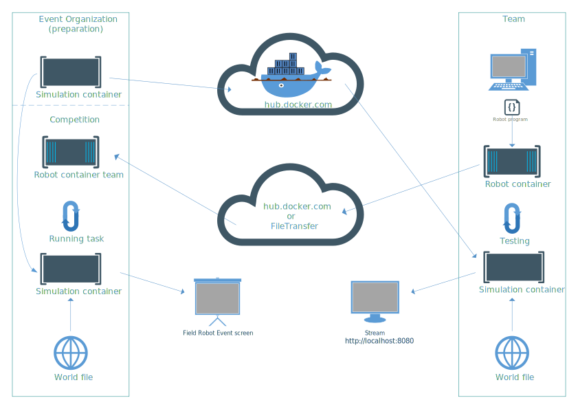

# Competition environment
This repository contains the `docker-compose` scripts needed to run a competition on your own computer. For each task, one `docker-compose` script is provided (a `cuda` and non-`cuda` version). These compose files are creating two Docker containers:

1. The simulation container that is simulating the virtual maize field and the robots sensor data. This container is created from the [simulation image](https://hub.docker.com/r/fieldrobotevent/simulation) and is provided by the organization. 
2. The robot container that is defining the robots behaviour and includes all software needed to run your robot. This container is created from a robot workspace image which is build by you. An [example workspace](https://github.com/FieldRobotEvent/example_ws) containing a Dockerfile to build a robot container is provided.



### Test competition on your own hardware
When testing the competition environment on your own computer, the simulation image is downloaded automatically from Dockerhub. The world files generated in the [virtual maize field](https://github.com/FieldRobotEvent/virtual_maize_field) in your robot workspace will be copied and used for the simulation. You can start the simulation by going to [https://localhost:8080](https://localhost:8080) in your webbrowser and press the play button.

### On the Field Robot Event
Before the Field Robot Event start, we ask you to give us your robot image using a USB-drive. The organization will hand out USB-drives for this purpose.  The world files used in the event are created by the organization. Your robot will be simulated on the hardware of the organization and the simulation will be projected on a screen and streamed to the internet.

For the simulation contest, you have to hand in both your robot workspace image and the zipped [simulation_files](/simulation_files) folder. To do this, create the `robot_workspace.tgz` container and `simulation_files.zip`: 
```
cd ~/<your_workspace_folder>
docker build . -t robot_workspace
docker image save robot_workspace | gzip -c - > robot_workspace.tgz
cd ~/<the_cloned_competition_environment_folder>
python3 scripts/copy_simulation_files.py
zip -r simulation_files.zip simulation_files/
```

Copy both files (`robot_workspace.tgz` container and `simulation_files.zip`) on the USB-drive and hand in the USB-drive on time. 

## Usage
To run the competition environment on your own computer, follow the steps below:
1. Create a Docker image of your robot workspace. This is explained in the [example workspace](https://github.com/FieldRobotEvent/example_ws).
   
2. Copy all files that are used for the simulation (meshes, textures, world files etc.) in the [simulation_files](/simulation_files) folder:
```commandline
python3 scripts/copy_simulation_files.py
```
This script will automatically find your robot workspace and copies the nessesary files to the correct folder.

3. Start the competition environment:
```commandline
cd task_navigation
docker-compose up
```
This starts the competition environment by creating a simulation container and a robot container. The simulation container will be downloaded automatically. 

4. Open GZWeb in the browser by going to [`http://localhost:8080/`](http://localhost:8080/) and press the play button to start the simulation. This works best by using Google Chrome.

To stop the simulation, press `ctrl+c` in the terminal and execute `docker-compose down` stop both containers. 

If you are not new to Docker and you are using a computer with a NVIDIA GPU, you can speed up the simulation by using the GPU inside the Docker. This is explained in more detail [here](doc/use_gpu_in_docker.md).

## Additional information
* [Create your robot container from scratch](doc/create_from_scratch.md)
* [Connect your local ROS installation to the competition environment](doc/connect_ros_to_containers.md)
* [Use a GPU to speed up simulation and use CUDA within a container](doc/use_gpu_in_docker.md)

## Troubeshooting

| Error | Cause | Solution |
|---|---| --- |
| `xvfb-run: error: Xvfb failed to start` | Another container is still running in the background. | Run `docker-compose down` and restart the container using `docker-compose up`. |
| `RLException: [simulation.launch] is neither a launch file in package [virtual_maize_field] nor is [virtual_maize_field] a launch file name` | Simulation container cannot find the simulation launch script, because it is not in the folder `simulation_files/launch`. | Run `python3 scripts/copy_simulation_files.py`. |

If you have another error or the provided solution does not work, create a [new issue](https://github.com/FieldRobotEvent/competition_environment/issues). Help expanding this list by making a [pull request](https://github.com/FieldRobotEvent/competition_environment/pulls).
